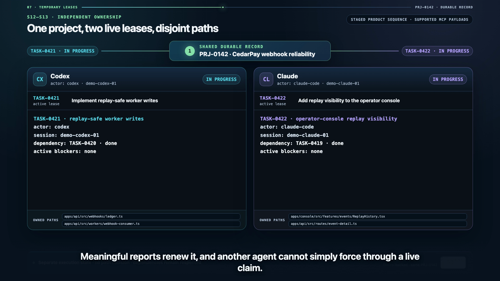

# Agent Continuity

**Persistent project execution across agents and sessions.**

The conversation is temporary. The agent is replaceable. The project state persists.

Agent Continuity is a local-first service that stores structured project state — projects,
context, tasks, acceptance criteria, dependencies, temporary claims, progress, blockers,
decisions, links and activity — so one AI agent can begin work and another can continue it
later without the user reconstructing anything by hand.

## Requirements and verification

Agent Continuity supports Node.js 24 or newer and the pnpm version pinned in
`package.json`. Enable Corepack before installing dependencies:

```bash
corepack enable
pnpm install --frozen-lockfile
```

The pull-request and `main` CI workflow runs `pnpm typecheck`, `pnpm test`,
`pnpm build`, and the Playwright end-to-end suite on Node 24. See
[CONTRIBUTING.md](CONTRIBUTING.md) for local validation expectations.

It replaces the `progress.md` / `TODO.md` pattern with something an agent can query,
mutate and hand over reliably.

## See it in action



<video src="https://raw.githubusercontent.com/wilkie1990/AgentContinuity/main/apps/video/deliverables/v2/agent-continuity-product-demo-v2-1080p.mp4" width="960" height="540"></video>

Watch the [verified V2 product demo](apps/video/deliverables/v2/agent-continuity-product-demo-v2-1080p.mp4)
with [English captions](apps/video/deliverables/v2/agent-continuity-product-demo-v2.en.vtt).
Release hashes, provenance, and the independent QA decision are recorded in the
[delivery manifest](apps/video/deliverables/v2/manifest.json).

## What is in the box

| Surface | Purpose |
| --- | --- |
| **MCP server** | The primary agent interface: 61 typed tools over stdio; the optional 47-tool agent profile trims schema context while preserving complete non-destructive agent work |
| **REST API** | `http://127.0.0.1:4732/api/v1`, the single public contract |
| **CLI** (`ac`) | Terminal access for humans and for agents without MCP (`--json`) |
| **Web UI** | Kanban board, task drawer, context editor, decisions, links, activity |
| **Skills** | `agent-continuity` and `project-bootstrap` teach agents how to behave |

Everything shares one domain layer (`packages/core`); no adapter holds its own business
rules.

## Quick start

```bash
pnpm install
pnpm build

# Start the API and web UI on http://127.0.0.1:4732
node apps/cli/dist/bin.js server

# Optional: create the Agent Continuity project described in the specification
pnpm seed
```

Open <http://127.0.0.1:4732> for the board.

### Run locally with Docker

Docker is supported for local use only; this project does not publish a container image.
Build and start the combined API and web UI with:

```bash
docker compose up --build -d
docker compose ps
curl --fail http://127.0.0.1:4732/health
```

The `agent-continuity-data` named volume is mounted at `/data`, so the SQLite workspace
survives `docker compose down` followed by `docker compose up`. Use
`docker compose down -v` only when you intentionally want to delete that local state.
The service is published to `127.0.0.1` only because it has no authentication. Do not
change the Compose port binding to `0.0.0.0` or expose it through a reverse proxy without
putting an appropriate trusted access boundary in front of it.

To use a different loopback port, set it consistently for Compose:

```bash
AGENT_CONTINUITY_PORT=4740 docker compose up --build -d
curl --fail http://127.0.0.1:4740/health
```

The Compose configuration sets `AGENT_CONTINUITY_HOST`, `AGENT_CONTINUITY_PORT`,
`AGENT_CONTINUITY_DATA_DIR`, `AGENT_CONTINUITY_DATABASE_PATH`,
`AGENT_CONTINUITY_LOG_LEVEL`, and `AGENT_CONTINUITY_CLAIM_TTL_MINUTES`; see
[Configuration](#configuration) for their meaning.

### Connect an agent over MCP

After `pnpm build`, use the local CLI to configure one of the documented clients:

```bash
node apps/cli/dist/bin.js install --client codex --dry-run
node apps/cli/dist/bin.js install --client codex

# Or configure Claude Code for this checkout:
node apps/cli/dist/bin.js install --client claude-code

# Explicitly opt in to lightweight lifecycle reminders:
node apps/cli/dist/bin.js install --client codex --session-integration enable
node apps/cli/dist/bin.js install --client claude-code --session-integration enable
```

The Codex adapter updates only `[mcp_servers.agent-continuity]` in
`.codex/config.toml` and links the two project skills into `.agents/skills/`. The Claude
Code adapter merges only `mcpServers.agent-continuity` in `.mcp.json` and links the
skills into `.claude/skills/`. Both use absolute paths to the current Node executable and
built MCP entry point.

The formats follow the current official [Codex MCP configuration](https://developers.openai.com/codex/mcp/)
and [Claude Code MCP configuration](https://docs.anthropic.com/en/docs/claude-code/mcp)
documentation. Existing unrelated configuration is preserved. A changed existing Agent
Continuity entry requires `--force`, existing config is copied to an adjacent
`.agent-continuity.bak` before mutation, and `--copy` installs skills as directories when
links are unsuitable. Repeated runs are idempotent. The Codex adapter preserves the file
as text and refuses unfamiliar multiline TOML when it cannot safely append the MCP table;
it reports the config path and leaves the file unchanged.

Session integration is opt-in and defaults to `--session-integration skip`. Enabling it
adds marker-owned `SessionStart` and `Stop` command hooks to `.codex/hooks.json` for
Codex or `.claude/settings.json` for Claude Code. Startup supplies only the provider's
opaque session identity; it does not query or inject Needs Attention, projects, tasks,
blockers, or user-authored text. Stop makes one exact-session read and requests one
continuation only when that session owns a live claim with a missing or stale checkpoint;
it never creates progress or heartbeat activity. Needs Attention is queried on demand
only when a conversation is actually managing tracked work. The probe has a 1.5-second
request timeout and fails open without output when Agent Continuity is unavailable. Run
the installer with `--session-integration remove` to remove only Agent Continuity's
lifecycle handlers.
Codex requires review of new or changed project hooks through `/hooks` before they run.
See [Session integrations](docs/session-integrations.md) for provider behavior and
limitations.

Restart the client after installation so it reloads its MCP and skill configuration. This
workflow operates from a local clone; it does not install or publish an npm package.

### Use the CLI

```bash
alias ac="node /absolute/path/to/AgentContinuity/apps/cli/dist/bin.js"

ac project create --name "Agent Continuity" --objective "Persistent execution for AI agents"
ac task create PRJ-0001 --title "Design task claim model" --status ready --priority high \
  --criterion "Defines expiry behaviour"
ac task list PRJ-0001 --actionable
ac task claim TASK-0001 --actor codex --session abc123
ac task plan TASK-0001 "Inspect" "Implement" "Verify"
ac task heartbeat TASK-0001 --phase "Implement"
ac task checkpoint TASK-0001 --completed "Inspection" --working-on "Implementation" --next "Verify"
ac task progress TASK-0001 "Initial lease data model designed."
ac task context TASK-0001 --set "Durable implementation constraints" --expected-version 0 \
  --reason "Capture the agreed approach"
ac task context TASK-0001 --history
ac task evidence TASK-0001 "Defines expiry behaviour" \
  --kind file --path packages/core/src/claims/service.ts
ac task evidence-policy TASK-0001 "Defines expiry behaviour" \
  --minimum-count 1 --kind test --require-sha --require-passing-verification
ac task verify TASK-0001 "Defines expiry behaviour" pnpm \
  --arg vitest --arg run --arg packages/core/src/__tests__/claims.test.ts \
  --timeout-ms 120000
ac search "lease expiry" --project PRJ-0001 --type task --type task_context
ac attention
ac task complete TASK-0001
ac activity PRJ-0001
```

Every read command supports `--json`.

`ac task verify` is the only command-execution surface. It requires the task's explicit
stored execution worktree, never falls back to the CLI process cwd, accepts an executable
and repeated `--arg` values (not a shell string), and persists bounded stdout/stderr tails
plus exit/timing/Git facts as `test` evidence. Output is not automatically redacted: a
verification command can print secrets, so choose commands accordingly. The default tail
is 64 KiB per stream (maximum 1 MiB) and the default timeout is 60 seconds (maximum 15
minutes). Timeout termination covers the process group on POSIX; Windows direct-child
termination is best-effort. A passing record does not mark the criterion complete.

## The model in one minute

- A **project** holds an objective and **project context**: persistent working memory that
  applies anywhere in the project.
- A **task** holds **task context**: what a future agent needs specifically to finish it.
- Context stays free-form Markdown, but every replacement is an immutable version. Saves
  carry the version they were based on, stale writes conflict instead of overwriting newer
  knowledge, and revert appends another version without deleting history.
- A task is **actionable** when it is `ready`, all dependencies are `done`, and it has no
  active blockers.
- A **claim** is a temporary lease (30 minutes by default), not an assignment. It expires,
  it renews itself whenever the owner records real work, and anyone can reclaim a lapsed
  one.
- An **execution** records who is actively working, heartbeat health, current phase and origin.
  **Checkpoints**, **work plans** and automatic **handoffs** make interrupted work resumable.
- The **Needs Attention** inbox surfaces stale or interrupted execution, handoffs, blockers
  and review work. Acceptance-criterion **evidence** links completion to proof.
- **Progress** records milestones, **decisions** record choices and their reasoning,
  **blockers** record what stopped the work, and **activity** is the append-only history of
  everything.

Identifiers are human readable — `PRJ-0001`, `TASK-0042`, `DEC-0007`, `BLK-0012`,
`LNK-0003` — and the API accepts either a key or a UUID.

## Configuration

Defaults live in `~/.agent-continuity/`:

```
~/.agent-continuity/workspace.db      SQLite database
~/.agent-continuity/config.json       optional configuration
```

```json
{
  "server": { "host": "127.0.0.1", "port": 4732 },
  "claims": { "defaultTtlMinutes": 30 }
}
```

Environment variables override the file: `AGENT_CONTINUITY_HOST`, `AGENT_CONTINUITY_PORT`,
`AGENT_CONTINUITY_DATA_DIR`, `AGENT_CONTINUITY_DATABASE_PATH`,
`AGENT_CONTINUITY_CLAIM_TTL_MINUTES`, `AGENT_CONTINUITY_LOG_LEVEL`.

The server binds to `127.0.0.1` and never listens publicly by default. v0.1 has no
authentication, no multi-user support and no cloud component.

## Reaching the UI from another device

By default the server only answers on `127.0.0.1`, so only this machine can reach it. That is
deliberate: v0.1 has no authentication, so anything the port is bound to has full read/write
access to the workspace.

If this machine runs [Tailscale](https://tailscale.com), the safest way to reach the board from
your phone, laptop, or another box on your tailnet is to bind loopback and the Tailscale
interface — never the whole LAN:

```bash
node apps/cli/dist/bin.js server --tailscale
# equivalent: node apps/cli/dist/bin.js server --host loopback,tailscale
```

A socket binds exactly one address, so this opens one listener per address, both backed by a
single workspace. `http://127.0.0.1:4732` keeps working on this machine while tailnet peers
reach `http://100.x.y.z:4732`. The Tailscale address is detected from OS network interfaces (an
IPv4 address in `100.64.0.0/10`) — no `tailscale` CLI required.

The startup banner prints every real URL, plus a warning that the service still has no
authentication: anyone on your tailnet who can reach it has full access.

To bind every interface on the local network instead (broader exposure, generally not
recommended), pass an explicit host:

```bash
node apps/cli/dist/bin.js server --host 0.0.0.0
```

The banner always lists concrete URLs — it never prints `http://0.0.0.0:PORT`, which is not a
URL anyone can open.

`AGENT_CONTINUITY_HOST` and `config.json`'s `server.host` accept the same values, including a
comma-separated list, if you'd rather configure this once instead of passing a flag every time:

```json
{ "server": { "host": "loopback,tailscale", "port": 4732 } }
```

Setting it in `config.json` also keeps the `ac` CLI pointed at the right address, which a
command-line flag alone cannot do.

## Documentation

- [`docs/architecture.md`](docs/architecture.md) — layers, domain rules, why they are where they are
- [`docs/api.md`](docs/api.md) — the REST surface and error model
- [`docs/mcp.md`](docs/mcp.md) — the MCP tool surface
- [`docs/development.md`](docs/development.md) — repository layout, testing, conventions
- [`AGENTS.md`](AGENTS.md) — repository guidance for coding agents

## Scope of v0.1

Included: local service, SQLite persistence, REST API, MCP server, CLI, web UI, Kanban
board, project and task context, acceptance criteria, dependencies, claims, progress,
blockers, decisions, generic links, activity timeline, project bootstrap, permanent task
and project deletion, and the two Skills.

Deliberately excluded: authentication, cloud hosting, multi-user, real-time collaboration,
native GitHub/Jira integrations, automatic Git operations, mobile, custom workflows,
billing, agent performance metrics.

Agent Continuity is not a Trello replacement, not a Jira replacement and not an AI memory
database. It is a persistent execution workspace for work performed through AI agents. The
board visualises work for humans; the API and MCP tools expose work to agents; Skills teach
agents how to behave. The project state survives them all.

## License

Copyright 2026 Adam Wilkinson. Agent Continuity is licensed under the
[Apache License 2.0](LICENSE).
